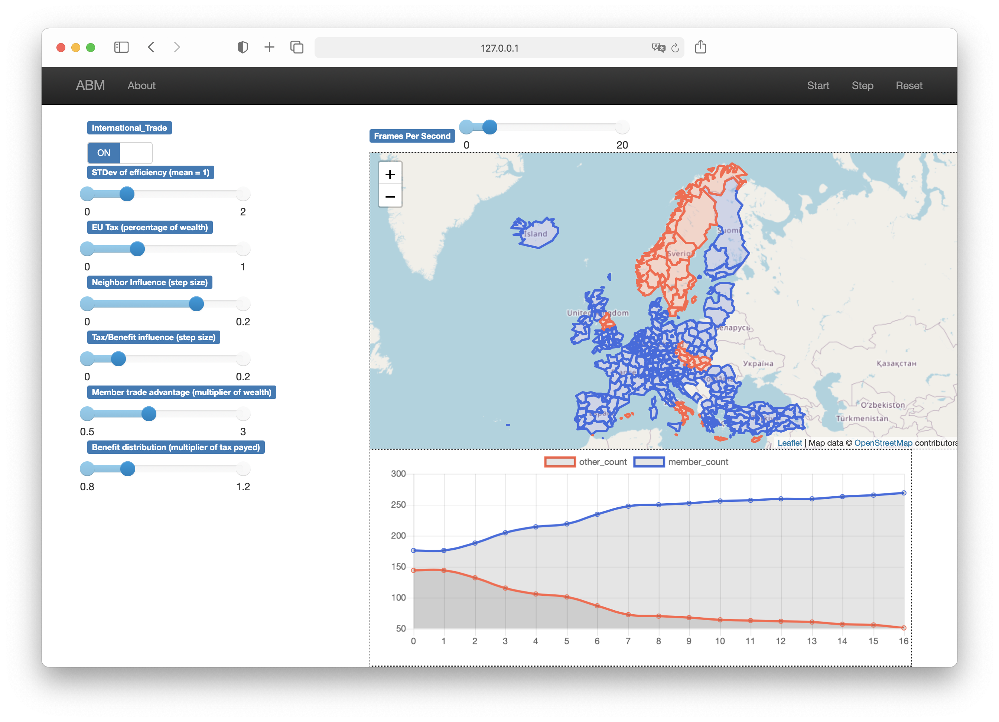

Aleksander Janczewski, Charel Felten, Mario van Rooij, Mehmet Ege Arkin

# Agent-based modelling

Agent-based model to simulate EU policy, wealth disparities and economic convergence.

Developed to answer the research question: *How can we sustain cooperation and economic convergence in the European Union?*

## Code

- ```model.py```: contains the model class
- ```agent.py```: contains the agent class
- ```server.py```: contains some code to create a local webserver to run the model

## Execution

In the ```model``` directory, run the command ```mesa runserver``` or ```python server.py``` to launch the web-interace on localhost. The model can also be ran from a class by initialising it and then manually calling ```model.step()``` to progress it.

## Web-Interface




## Acknowledgment

The model is an extension of the Schelling example from mesa geo: https://github.com/Corvince/mesa-geo


